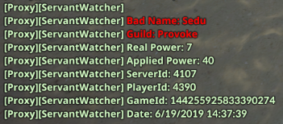
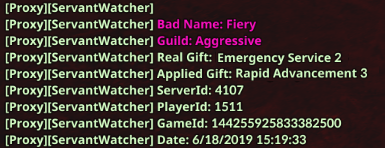
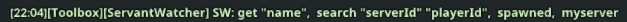
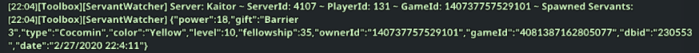
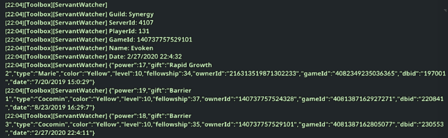
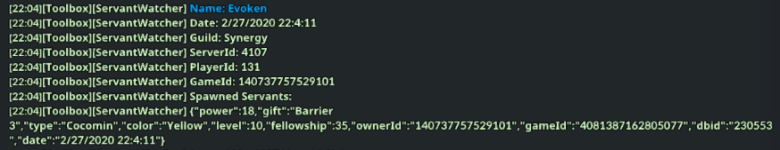
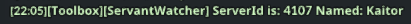

# ServantWatcher - Overview
Be automatically notified when someone cheats using https://github.com/Lambda11/pet-skill-replacer-and-user

Power Cheat: Receiving more power than your pet is capable of giving



Ability Cheat: Using a pet ability that your pet doesn't know



# How the Platform Works
```javascript
mod.hook('S_LOGIN', 14, (event) => {
    // any code here is executed once a packet matching the S_LOGIN.14.def file is received
    // the packet's data is stored in the `event` variable according to the S_LOGIN.14.def
    // its fields like `level` can been accessed by `event.level`
});
```

# How the Script Works
Spawning players and pets/servants sends their respective packets. Thus, allowing me to access and store their data in that player's JSON file for later viewing. These packets are always followed by packet's specifying the player's buffs. So, I check the player's buffs from pets against their pet's data. If there is a conflict, it means that player is cheating. So I display their information as seen in the screenshot above. Players can then take this screenshot to https://support.enmasse.com/hc/en-us to report that player and get them banned for cheating.

# What Each File Does
* config.json - Stores serverId to Name data

* settings_migrator.js - Updates config.json

* index.js - The code

* manifest.json & module.json - Automatically downloads script updates from GitHub

# Chat Commands
sw
* Lists all commands



sw get "name"
* Lists the: serverId, playerId, and gameId of the player so that you can `sw search` for them
* Example usage: `sw get name`



sw search "serverId" "playerId"
* Lists the: serverId, playerId, gameId, all known names, last seen dates of names, and all seen servants for the specified player
* Example usage: `sw search 4107 131`



sw spawned
* Lists the: serverId, playerId, gameId, name,  date of last seen, and currently spawned servants for all spawned players
* Example usage: `sw spawned`



sw myserver
* Lists the current serverId and server name
* Example usage: `sw myserver`


